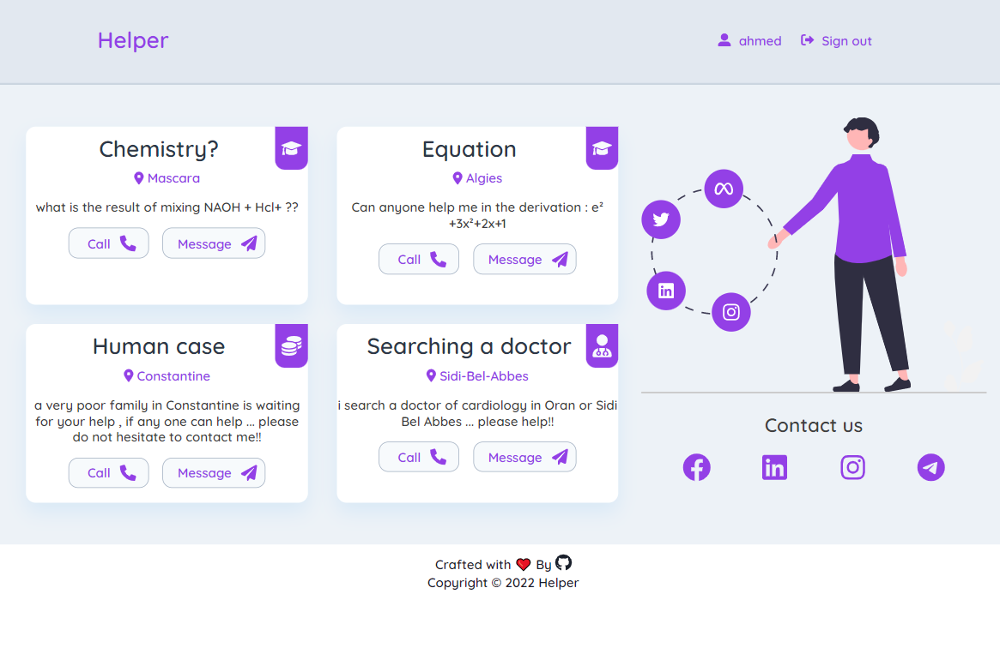
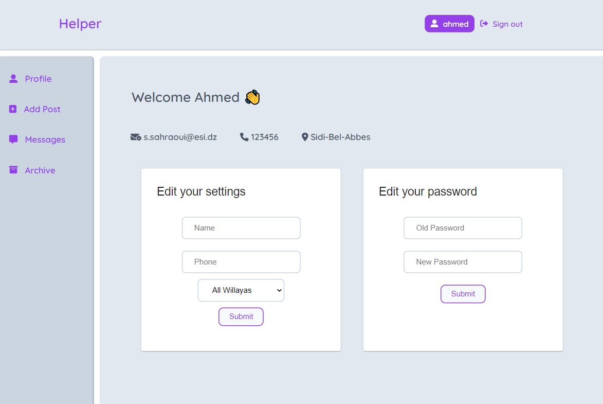

# Helper

 
**Helper** is a web application built using _ReactJs_ _NodeJs_ _ExpressJs_ _MongoDB_  providing a service for sharing medical, education and financial help request posts.

### _Screenshots_

 

**Live preview:** [Helper]   Coming soon

### How to use

1. Clone/Download the repository.
2. Install dependencies:
   <code>yarn install</code> or <code>npm install</code>
3. Run <code>yarn start</code> or <code>npm start</code>.
4. You are ready [http://localhost:3000](http://localhost:3000)
